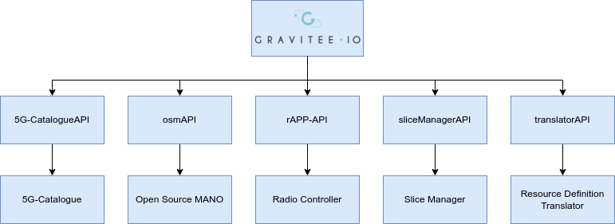

# xRM

## Introduction
The Any Resource Manager (xRM) is a module in the 5GZORRO Platform, available in each stakeholder domain, that directly interacts with the underlying 5G Virtualized Platform, offering, towards the upper layer applications, a set of services related to the resources monitoring and management, including a direct support to the 5GZORRO Resource and Service Offering Catalogue (RSOC) through a translation service for the on-demand translation of technical descriptors (virtual network function resources, network services, radio resources, spectrum resource, edge resources, cloud resources, slice services) into proper resource and service models defined by the TM Forum.

Please note that the docker images in this repository were built targetting the 5G-Barcelona testbed as virtualized environment, follow the installation sections for further informations.
Consider also that the xRM is the lowest layer of the 5G ZORRO architecture, so some of the component that are managed by the xRM itself that are deployed in the underlying layer could not be available to be used with the APIs defined by the xRM after the latter has been deployed (i.e., Radio Controller)



## Prerequisites

### System Requirements
- 4 vCPU
- 6GB RAM

### Software dependencies
- Docker (tested with 20.10.8)
- Docker Compose (tested with 1.28.5)
- OSM release 10
- [5G-Catalogue](https://github.com/nextworks-it/5g-catalogue) 

### 5GZORRO Module dependencies
- [Resource Definition Translator](https://github.com/5GZORRO/resource-definition-translator)
- [Slice Manager](https://github.com/5GZORRO/slice-manager)
- Radio Controller

## Installation

## Deployment with docker-compose
- Customize the enviroment variables in ```xRM/.env``` and ```xRM/5g-catalogue-app/profiles/default.env```
- In docker-compose.yaml update the MGMT_API_URL (management_ui service) and PORTAL_API_URL (portal_ui service) environment variables specifying the IP address of the machine on which the xRM will run.
- from ```xRM/``` run:
  ```bash
    docker-compose up --build -d
  ```

## Deployment with Kubernetes
- (Optional, you can use the image on this repository) Build the kafka docker image
  ```bash
    cd kafka
    docker build -t kafka -f Dockerfile .
  ```
- Build the 5gcatalogueapp docker image, the only arguments that need to be customized are those related to the MANO 
  ```bash
    cd 5g-catalogue-app
    docker build -t 5gcatalogueapp -f Dockerfile \
    --build-arg catalogue_repo=https://github.com/nextworks-it/5g-catalogue.git \
    --build-arg catalogue_version=5g_zorro \
    --build-arg catalogue_server_port=31086 \
    --build-arg nfv_sol_libs_repo=https://github.com/nextworks-it/nfv-sol-libs.git \
    --build-arg nfv_sol_libs_version=master \
    --build-arg nfv_ifa_libs_repo=https://github.com/nextworks-it/nfv-ifa-libs.git \
    --build-arg nfv_ifa_libs_version=dev_5growth \
    --build-arg mano_id=ZORRO_OSMR10 \
    --build-arg mano_type=OSMR10 \
    --build-arg mano_site=ZORRO_OSM \
    --build-arg mano_ip=172.28.3.59 \
    --build-arg mano_port=9999 \
    --build-arg mano_username=admin \
    --build-arg mano_password=admin \
    --build-arg mano_project=admin \
    --build-arg public_catalogue_id=DEFAULT_CAT \
    --build-arg public_catalogue_url=http://127.0.0.1:8083/ \
    --build-arg proxy_enabled=false \
    .
  ```
- (Optional, you can use the image on this repository) Build the 5gcataloguegui docker image, the only argument that need to be changed is the catalogue server port only if you want to change the port of the catalogue app in the k8s service.
  ```bash
    cd 5g-catalogue-gui
    docker build -t 5gcataloguegui -f Dockerfile \
    --build-arg catalogue_repo=https://github.com/nextworks-it/5g-catalogue.git \
    --build-arg catalogue_version=5g_zorro \
    --build-arg catalogue_server_port=31086 \
    --build-arg catalogue_scope=PUBLIC \
    --build-arg catalogue_profile=default \
    --build-arg keycloak_enabled=false \
    --build-arg keycloak_url=http://127.0.0.1:8080/auth/ \
    --build-arg keycloak_realm=osm \
    --build-arg keycloak_gui_client=5gcatalogue \
    .
  ```
- (Optional, you can use the image on this repository) Build the resource-definition-translator docker image
  ```bash
    cd resource-definition-translator
    docker build -t resource-definition-translator -f Dockerfile \
    --build-arg NFV_SOL006_LIBS_REPO=https://github.com/nextworks-it/nfv-sol-libs.git \
    --build-arg NFV_SOL006_LIBS_VERSION=master \
    --build-arg TMF_INFO_MODELS_REPO=https://github.com/5GZORRO/resource-and-service-offer-catalog.git \
    --build-arg TMF_INFO_MODELS_VERSION=main \
    --build-arg TRANSLATOR_REPO=https://github.com/5GZORRO/resource-definition-translator.git \
    --build-arg TRANSLATOR_VERSION=main \
    .
  ```
- Push the images you built in a docker registry and update each k8s deployment file (kafka-deployment.yaml, catalogueapp-deployment.yaml, cataloguegui-deployment.yaml, translator-deployment.yaml) with the new image paths; update also the imagePullSecret accordingly.
- update the MGMT_API_URL (management-ui-deployment.yaml) and PORTAL_API_URL (portal-ui-deployment.yaml) environment variables specifying the hostname and port of the management-api-service.
- If needed, customize the environment variables in the k8s deployment files.
- deploy the xRM
  ```bash
    kubectl apply -f k8s/
  ```


## Configuration
After the deployment of the Any Resource Manager, the component should be configured with the APIs that need to be exposed by the Northbound Interface of the xRM itself. The folder `gravitee_api/` contains the definition of the APIs that can be imported into the xRM for each of the component that can be managed by the Resource Manager.
To import the APIs defined for a given component (the 5G-Catalogue will be taken as example in the following description) you have to:
- update the targetted endpoint where the component is available in the json API definition (proxy.groups.0.endpoints.0.target)
- import the API in the Management Interface accessing the correspondent service through its exposed web interface (admin/admin)
- create the correspondent application in the Web Portal Interface in order to connect an app to a set of APIs: a Gravitee API-Key will be released to access the APIs.

For further details you can follow the [official guidelines](https://docs.gravitee.io/apim/3.x/apim_publisherguide_import_apis.html) for importing and creating APIs within gravitee.

## Maintainers
**Pietro Giuseppe Giardina** - *Design* - p.giardina@nextworks.it </br>
**Michael De Angelis** - *Develop and Design* - m.deangelis@nextworks.it </br>

## License
This module is distributed under [Apache 2.0 License](LICENSE) terms.